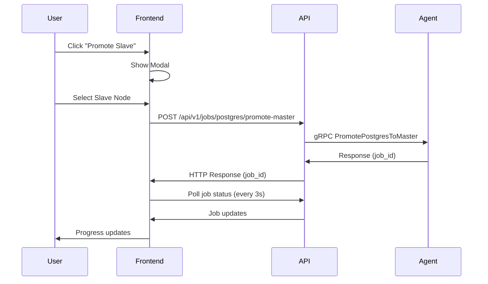
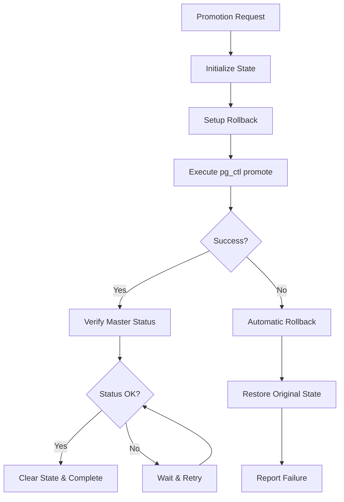

# PostgreSQL Promote Slave Functionality - Comprehensive Analysis

## 📋 Executive Summary

ClusterEye Agent sistemi, PostgreSQL cluster ortamında manuel slave promotion (köle düğümünü master'a yükseltme) işlevselliği sağlamaktadır. Bu sistem 3 katmanlı bir mimariye sahiptir:

1. **Frontend (React)** - Kullanıcı arayüzü ve modal sistemi
2. **API (gRPC)** - Merkezi koordinasyon ve job yönetimi  
3. **Agent (Go)** - Düğüm seviyesinde promotion işlemleri

## 🏗️ Sistem Mimarisi

### 1. Frontend Katmanı

**Dosya:** `clustereye_frontend/src/NodeStatusGrid.tsx`

#### Promote Slave Modal Özellikleri:
- **Trigger:** "Promote Slave" butonu (sadece admin kullanıcılar)
- **Cluster Selection:** Hedef PostgreSQL cluster seçimi
- **Slave Node Selection:** Promotion için uygun slave node seçimi
- **Progress Tracking:** 3 adımlı progress modal
- **Real-time Updates:** 3 saniye aralıklarla job polling

#### Modal Workflow:
```typescript
// Modal açılışı
showPromoteSlaveModal(clusterName, nodes) 
  → setSelectedCluster()
  → setIsPromoteSlaveModalVisible(true)

// Promotion işlemi
handlePromoteSlave()
  → API çağrısı: /api/v1/jobs/postgres/promote-master
  → Job tracking başlatma
  → Progress modal gösterimi
```

#### Progress Steps:
1. **Step 1:** "Preparing to promote slave node"
2. **Step 2:** "Promoting slave to master"  
3. **Step 3:** "Waiting for promotion to complete"

### 2. API Katmanı (gRPC)

**Ana Dosya:** `clustereye-agent/internal/reporter/reporter.go`

#### gRPC Service Methods:

##### A. PromotePostgresToMaster
```go
func (r *Reporter) PromotePostgresToMaster(
    ctx context.Context, 
    req *pb.PostgresPromoteMasterRequest
) (*pb.PostgresPromoteMasterResponse, error)
```

**Request Parameters:**
- `JobId` - Unique job identifier
- `AgentId` - Format: "agent_{hostname}"
- `NodeHostname` - Target node hostname
- `DataDirectory` - PostgreSQL data directory path
- `CurrentMasterHost` - Current master host (optional)
- `Slaves` - List of slave node information

**Response:**
- `Status` - Job status enum (PENDING, IN_PROGRESS, COMPLETED, FAILED)
- `Result` - Operation result message
- `ErrorMessage` - Error details if failed

##### B. ConvertPostgresToSlave
```go
func (r *Reporter) ConvertPostgresToSlave(
    ctx context.Context,
    req *ConvertPostgresToSlaveRequest
) (*ConvertPostgresToSlaveResponse, error)
```

**Purpose:** Eski master'ı slave'e dönüştürme (coordination işlemi)

#### Command Processing:

##### Command Format:
```
postgres_promote|data_dir|process_id|new_master_host|old_master_host|old_master_ip|slave_count|slaves_info
```

**Örnek:**
```
postgres_promote|/var/lib/postgresql/15/main|job_123|slave-node-2|master-node-1|192.168.1.10|2|slave-node-3:192.168.1.12
```

### 3. Agent Katmanı (Core Logic)

**Ana Dosya:** `clustereye-agent/internal/collector/postgres/failover.go`

#### PostgreSQLFailoverManager

Bu sınıf tüm failover ve promotion operasyonlarını yönetir:

```go
type PostgreSQLFailoverManager struct {
    cfg           *config.AgentConfig
    currentState  *FailoverState
    stateFilePath string
}
```

#### Core Methods:

##### A. PromoteToMasterWithLogger
```go
func (fm *PostgreSQLFailoverManager) PromoteToMasterWithLogger(
    dataDir string, 
    logger Logger
) error
```

**İşlemler:**
1. **State Initialization:** Promotion state kaydetme
2. **Automatic Rollback Setup:** Panic durumunda otomatik rollback
3. **pg_ctl Command Execution:** `pg_ctl promote -D {dataDir}`
4. **Status Verification:** Node durumu kontrolü (MASTER/PRIMARY)
5. **State Cleanup:** Başarılı durumda state temizleme

##### B. ConvertToSlaveWithIPAndLogger
```go
func (fm *PostgreSQLFailoverManager) ConvertToSlaveWithIPAndLogger(
    dataDir, masterIP string,
    newMasterPort int,
    replUser, replPassword, pgVersion string,
    logger Logger
) error
```

**İşlem Adımları:**
1. **PostgreSQL Stop:** Service durdurma
2. **Data Directory Backup:** Mevcut data'yı backup alma
3. **pg_basebackup:** Fresh backup alma (-R parametresi ile)
4. **Standby Configuration:** Otomatik standby konfigürasyonu
5. **PostgreSQL Start:** Standby modunda başlatma

#### Rollback Mechanism

##### FailoverState Structure:
```go
type FailoverState struct {
    JobID              string
    StartTime          time.Time
    CurrentStep        string
    CompletedSteps     []string
    BackupPaths        map[string]string
    OriginalConfig     map[string]string
    OriginalNodeStatus string
    CanRollback        bool
    RollbackReason     string
}
```

##### Automatic Rollback Triggers:
- **Panic Recovery:** defer function ile panic yakalama
- **Error Conditions:** Critical adımların başarısızlığı
- **Timeout:** İşleminin zaman aşımı
- **Critical Steps:** `data_directory_cleaned`, `pg_basebackup_completed`, `promotion_completed`

### 4. Process Logging & Job Management

**Dosya:** `clustereye-agent/internal/reporter/process_logs.go`

#### ProcessLogger Features:
```go
type ProcessLogger struct {
    client      pb.AgentServiceClient
    agentID     string
    processID   string
    processType string
    metadata    map[string]string
}
```

**Key Methods:**
- `Start()` - Job başlatma
- `LogMessage(message)` - İşlem logları
- `AddMetadata(key, value)` - Metadata ekleme
- `Stop(status)` - Job sonlandırma

#### Job Status Tracking:
- `JOB_STATUS_PENDING`
- `JOB_STATUS_IN_PROGRESS`
- `JOB_STATUS_COMPLETED`
- `JOB_STATUS_FAILED`

## 🔄 Complete Promotion Workflow

### 1. Frontend → API Flow



### 2. Agent Internal Flow



### 3. Coordination Process

#### Master → Slave Conversion:
1. **Old Master Conversion:** `ConvertPostgresToSlave` çağrısı
2. **Data Directory Operations:**
   - PostgreSQL stop
   - Backup creation
   - Directory cleanup
   - Fresh pg_basebackup
3. **Configuration Updates:**
   - PostgreSQL 12+: `postgresql.auto.conf` + `standby.signal`
   - PostgreSQL 11-: `recovery.conf`
4. **Service Restart:** Standby modunda başlatma

#### Other Slaves Reconfiguration:
- `ReconfigureSlaveToNewMaster` method
- Configuration files update to point new master
- Connection string updates

## 🛡️ Error Handling & Rollback

### Rollback Scenarios:

#### 1. Automatic Rollback Conditions:
- **Panic during promotion**
- **pg_ctl command failure**  
- **Service start failure**
- **Network connection issues**
- **Permission problems**

#### 2. Rollback Operations:
```go
// Rollback steps (reverse order)
for i := len(completedSteps) - 1; i >= 0; i-- {
    switch step := completedSteps[i] {
    case "postgresql_stopped":
        rollbackPostgreSQLStop()
    case "config_backup_created":
        rollbackConfigChanges()
    case "data_directory_backed_up":
        rollbackDataDirectoryChanges()
    case "standby_config_created":
        rollbackStandbyConfig()
    }
}
```

#### 3. Coordination Rollback:
- Cross-node rollback coordination
- API-level rollback signaling
- Split-brain prevention
- Metadata-based rollback requests

### Safety Mechanisms:

#### 1. State Persistence:
- **File:** `/tmp/clustereye-failover/failover-state.json`
- **Content:** Complete failover state
- **Purpose:** Recovery after crashes

#### 2. Backup Strategy:
- **Data Directory:** Full backup before operations
- **Configuration Files:** Original configs preserved
- **Retention:** Multiple timestamped backups

#### 3. Validation Checks:
- **Node Status:** Pre and post validation
- **Service Status:** PostgreSQL service health
- **Replication Status:** Streaming replication validation
- **Network Connectivity:** Master-slave connectivity tests

## 📊 Monitoring & Debugging

### 1. Log Sources:
- **Frontend:** Browser console, network requests
- **API:** gRPC service logs, job processing logs
- **Agent:** Process logs, failover manager logs, PostgreSQL logs

### 2. Key Metrics:
- **Promotion Success Rate**
- **Rollback Frequency**  
- **Average Promotion Time**
- **Error Classification**

### 3. Debug Information:
```go
// Debug log örneği
logger.LogMessage(fmt.Sprintf("DEBUG: ConvertToSlaveWithIP adım 1 - IP adresi direkt kullanılıyor: %s", masterIP))
logger.LogMessage(fmt.Sprintf("DEBUG: ConvertToSlaveWithIP adım 2 - Data directory backup/temizleme başlatılıyor"))
logger.LogMessage(fmt.Sprintf("DEBUG: ConvertToSlaveWithIP adım 3 - pg_basebackup başlatılıyor"))
```

## 🔧 Configuration Management

### PostgreSQL Version Support:
- **PostgreSQL 12+:** `postgresql.auto.conf` + `standby.signal`
- **PostgreSQL 11-:** `recovery.conf` method
- **Version Detection:** Automatic version parsing
- **Command Paths:** Multiple pg_ctl path resolution

### Service Management:
```go
// Service names tried (in order)
serviceNames := []string{
    fmt.Sprintf("postgresql@%d-main", majorVersionInt), // Ubuntu cluster
    "postgresql",                                        // Generic
    fmt.Sprintf("postgresql-%d", majorVersionInt),       // RHEL/CentOS
    "postgresql.service",                               // Explicit service
}
```

## 🔍 Potential Improvements

### 1. Enhanced Error Handling:
- **Detailed Error Classification**
- **Custom Rollback Strategies**
- **Network Failure Recovery**
- **Timeout Customization**

### 2. Performance Optimizations:
- **Parallel Backup Operations**
- **Incremental Backup Support**
- **Compression for Large Data Transfers**
- **Connection Pooling**

### 3. Monitoring Enhancements:
- **Real-time Metrics Dashboard**
- **Historical Promotion Analytics** 
- **Predictive Failure Detection**
- **Automated Health Checks**

### 4. Configuration Flexibility:
- **Configurable Timeouts**
- **Custom pg_ctl Paths**
- **Backup Retention Policies**
- **Network Interface Selection**

## 🎯 Conclusion

ClusterEye Agent'ın PostgreSQL Promote Slave functionality'si, enterprise-grade bir failover sistemi sunar. Sistem:

✅ **Robust Error Handling:** Comprehensive rollback mechanisms  
✅ **Cross-platform Support:** Multiple PostgreSQL versions and OS  
✅ **State Management:** Persistent state for crash recovery  
✅ **Real-time Monitoring:** Process logging and job tracking  
✅ **Coordination Support:** Multi-node failover coordination  
✅ **User-friendly Interface:** Intuitive frontend modal system  

Sistem production kullanımına hazır durumda olup, high-availability PostgreSQL cluster'ları için güvenilir bir failover çözümü sağlamaktadır.